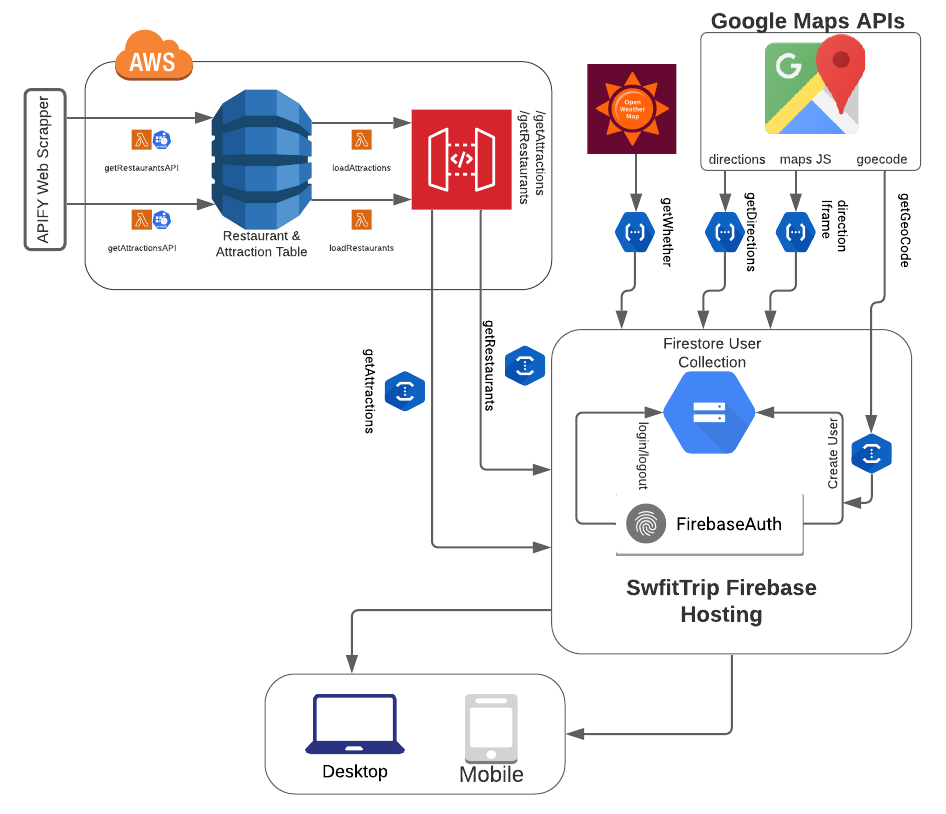

# SwiftTrip

SwfitTrip is a one stop web application that shows you restaurants and attractions in the Chapel Hill area. SwiftTrip sorts locations by projected current occupancy. This way users can save time in their visits to places, while also remaining socially distant amid the pandemic. This repository contains the source code and is split in to two main parts: AWS Serverless Lambda functions and the Firebase Web App

## Tech Stack Visualization

## API Sources
- APIFY Google Maps Crawler by Jakub Drobink:
  - This web scrapper takes in a query and webscrapes Google Maps. I created two tasks through APIFY, one for restaurants, and one for attractions.
  - This source was used because it provides an array that shows popular times for places on Google Maps
  - They are called by two AWS functions every 24 hours through a cron job, as the APIFY endpoint can take a while to respond
  - As the execution is over, all data is transferred straight to DynamoDB
- OpenWeatherMap:
  - This API provides the weather tip that is presented on the main application page
- Google Maps Geocode API
  - The geocode api is called each time an account is made, to geocode the users location into a Google Map's placeid
- Google Maps Direction API
  - The direction api is called to find the directions from a users location to a place the select in the application  (restaurant, attraction)
  - The user placeId that was geocoded prior is pulled from Firestore and directions are provided
- Google Maps Embed API
  - The Embed API is shown to render a small square on each location card element to show where that location is located in Chapel Hill

## AWS Lambda Functions
I have created two lambda functions set up as cron jobs to update the DynamoDB tables every 24 hours. Two other functions take the data from DynamoDB process it and display it back to the application via exposed API endpoints created in AWS API Gateway. This ensures that the front end stays relatively light as all data processing is on the backend.

## Firebase Configuration
Firebases house the hosting for the entire website as well as user accounts and other backend functions. All user information is stored in Firestore. Access to application resources are only permitted if there is logged in user. From here 5 firebase functions call outside resources (AWS API Endpoints, Geocode API, Directions API, and OpenWeatherMap).

## Other Info
All API access keys have been removed from this repository.